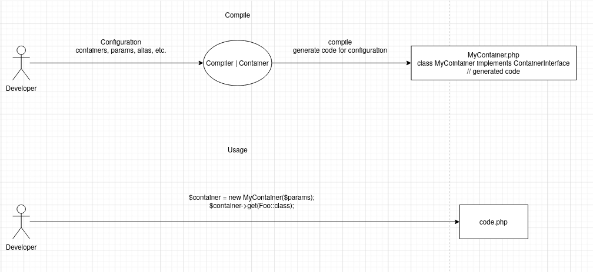

# Getting started with Cekta/DI
[](https://t.me/dev_ru)
[](https://dashboard.stryker-mutator.io/reports/github.com/cekta/di/master)
[](https://packagist.org/packages/cekta/di)
[](https://packagist.org/packages/cekta/di)

[psr/container](https://www.php-fig.org/psr/psr-11/) implementation for humans

## Features

 * Autowiring support Union Types, Intersection Types, DNF Types, and variadic arguments
 * Supports Autowiring with automatic constructor-based configuration
 * Allows you to manually configure any dependency via closures.
 * Support interface and abstract classes
 * High code quality (see the badges).
 * Supports opcache compilation (fast).

## Install via [composer](https://getcomposer.org/)

```
composer require cekta/di
```

## Video demonstration (russian)

[](https://www.youtube.com/watch?v=0OrVX1V6s5E)

## How it works


1. Create script /bin/compile.php (or command for symfony/console, or use Container::make) in project 
```php
<?php

require __DIR__ . '/vendor/autoload.php';
$filename = __DIR__ . '/../runtime/MyContainer.php';
$compiler = new \Cekta\DI\Compiler(
    /* you configuration see available arguments */
    fqcn: 'App\Runtime\MyContainer', // configure autoloads for support target namespace
    containers: [
        // list available entrypoints must be resolved and available by get method
        MyContoller::class,
        'db_type', // required for usage get in Lazy
        'db_path', // required for usage get in Lazy
    ], 
    params: [
        // all configured dependency, or pre created, or Lazy loaded
        'username' => 'value for username',
        'password' => 'load you secret value',
        'options' => [],
        'db_type' => 'sqlite',
        'db_path' => __DIR__ . '/../db.sqlite',
        'dsn' => new \Cekta\DI\Lazy(function (\Psr\Container\ContainerInterface $c) {
            return sprintf('%s:%s',$c->get('db_type'), $c->get($c->get('db_path')));
        }),
    ], 
    alias: [
        // register implementation for interface, abstract classes or alias for exist value
        SomeInterfaceOrAbstractClass::class => ImplementationSecond::class,
        'dbPath' => 'db_path', // camelCase name, but value loaded from db_path
    ],
    // see arguments
);
file_put_contens($filename, $compiler->compile());
```
2. add run compiler on ci/cd (build or deploy stage), or run it manually for regenerate MyController
4. Use it
```php
<?php
require __DIR__ . '/vendor/autoload.php';

$container = new App\Runtime\MyContainer([
    // send actual params value
    // params declaration can be moved to provider like Config and can be roused here and in compile.php
    'username' => 'value for username (actual)', // sqlite not used this param but other db required correct value
    'password' => 'load you secret value (actual)', // sqlite not used this param but other db required correct value
    'options' => [],
    'db_type' => 'sqlite',
    'db_path' => __DIR__ . '/../db.sqlite',
    'dsn' => new \Cekta\DI\Lazy(function (\Psr\Container\ContainerInterface $c) {
        return sprintf('%s:%s',$c->get('db_type'), $c->get($c->get('db_path')));
    }),
]);

$example = $container->get(MyContoller::class); // any container from containers list at compilation
```

and some stub for code
```php
<?php

class MyController
{
    public function __construct(
        private PDO $connection,
        private SomeInterfaceOrAbstractClass $example,
        private string $dbPath, // this value work via alias and really value will be db_path
    )
    
    public function handle() {
        // you payload
        // dependency available by $this->>pdo or $this->>example or $this->dbPath
    }
}

interface SomeInterfaceOrAbstractClass{}

class ImplementationSecond implements SomeInterfaceOrAbstractClass{};
```

more complex example see in [acceptance test](./tests/AcceptanceBase.php)